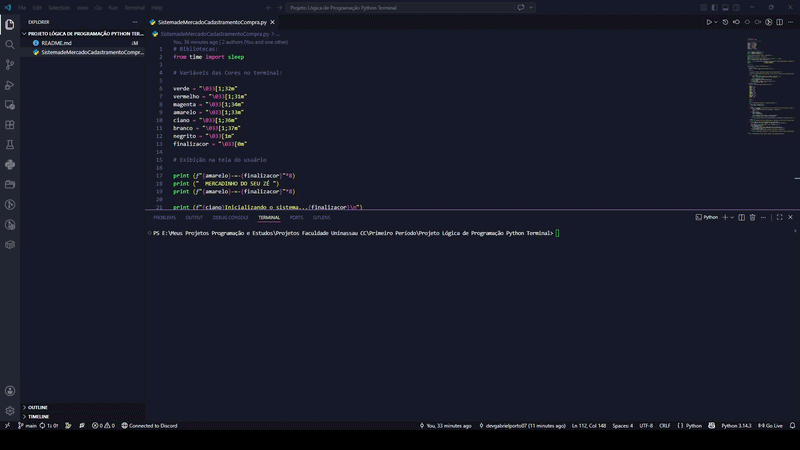

# 🛒 Mercadinho do Seu Zé

Sistema de cadastramento e compras de produtos via terminal, desenvolvido em Python como projeto prático da disciplina de Lógica de Programação.

---

##  Sobre o Projeto:

O **Mercadinho do Seu Zé** simula um sistema de mercado no terminal com duas funcionalidades principais:

- **Cadastro de Produtos** — o usuário cadastra produtos e seus valores, formando uma lista
- **Compra de Produtos** — o usuário seleciona itens de um estoque fixo, monta um carrinho e realiza o pagamento com cálculo de troco

O projeto foi desenvolvido utilizando apenas conceitos fundamentais de Python e um pouco de Git: estruturas de repetição, condicionais, dicionários, listas e formatação colorida no terminal.

---

## Preview:

>  *GIF de demonstração em breve*

<!--  -->


---

##  Como Rodar o Projeto:

### Pré-requisitos

- [Python 3.x](https://www.python.org/downloads/) instalado na máquina

### Passo a passo:

```bash
# 1. Clone o repositório
git clone https://github.com/seu-usuario/nome-do-repositorio.git

# 2. Acesse a pasta do projeto
cd nome-do-repositorio

# 3. Execute o arquivo
python SistemaMercadoCadastramentoCompra.py
```

> ⚠️ No Windows, caso `python` não funcione, tente `python3` ou `py`

---

## ⚒ Tecnologias Utilizadas:

- **Python 3** — linguagem principal
- **Biblioteca `time`** — para efeitos de delay no terminal para passar a impressão que o sistema do mercadinho seja antigo
- **Cores ANSI** — para estilização da interface no terminal

---

## Conceitos Aplicados:

- Estruturas condicionais (`if`, `elif`, `else`)
- Estruturas de repetição (`for`, `while`)
- Listas e Dicionários
- Entrada e saída de dados
- Formatação de strings com f-strings
- Comandos básicos do Git: 
- git init
- git add .
- git commit -m ""
- git push
- git pull
- git clone ""
---

## Autor

Feito por **Gabriel Porto** — estudante de Ciência da Computação na UNINASSAU.

---

## Contribuidores

- [@Marcos Soares](https://github.com/mssoaress)
- [@Daniel Mota](https://github.com/dplayerf)

---

## Contato

Dúvidas ou sugestões? Abre uma issue no repositório ou me chama nas redes.

---

>  *Projeto desenvolvido para fins educacionais — Primeiro Período, Lógica de Programação*
